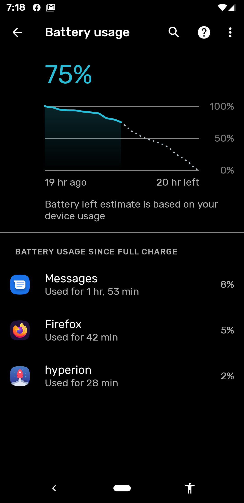
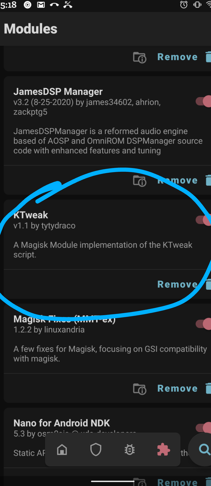
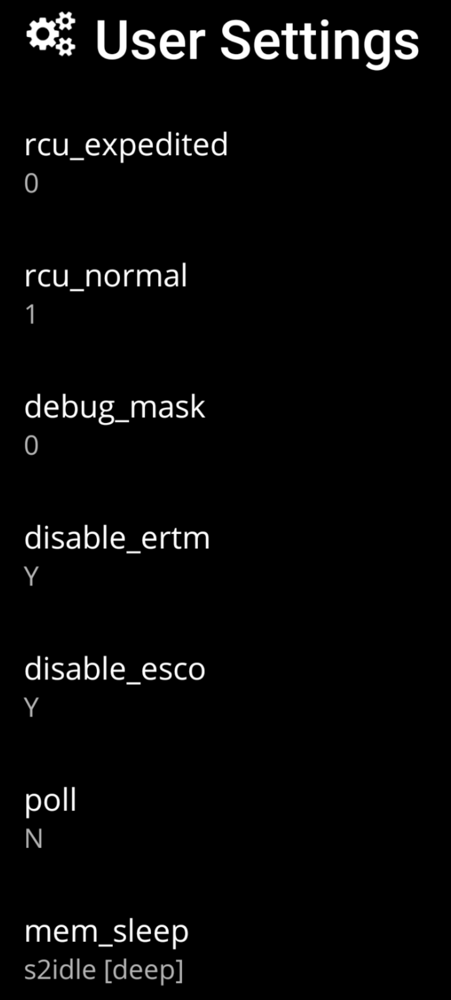

# 4android
Some tweaks -  Google Pixel 3a Sargo



## BlackenedMOD
https://forum.xda-developers.com/pixel-3-xl/development/mod-blackenedmod-v1-0-pixel-3-pixel-3-xl-t3887158
For Blackenmods you'll just need to drop the script into /data/adb/service.d.

## KTWEAK ( My personal pref. for custom kernel tweaks, other than BlackenedMod most others are placebo)

https://forum.xda-developers.com/android/software/module-ktweak-evidence-t4148447
For Ktweaks theres some debate on this and currently the APK & Magisk Module on the XDA Page don't install 
on Android 11 (which is what I'm using) But fortunately I've found a workaround that successfully installs the 
module and keeps the script up to date on boot.

First Step : which I've done for you already is to change the script to ```#!/system/bin/sh``` then adjust the max
cpu freq.  

Second Step : Is to flash the script with whatever kernel manager you prefer I use SP Kernel Auditor, and 
check it as run on boot.  

3rd Step : Move the script out of your downloads folder into your standard home directory.
copy it to ```/data/adb/service.d``` and change permissions to 0755.  

Finish it : Reboot and you'll notice the Log now updating to 
tell you its running correctly and if you check magisk KTweak Module now appears correctly in your module tab.




Personal Settings - Ideally using Elemental X Kernel Manager well easiest anyway.  These are largly useless modules
that can take up a large margin of battery life and overall system wide performance.  Especially the two bluetooth
modules.  I've cherry picked and tested lots of custom user settings and combined with KTweaks these few modules
give a huge improvement on cpu goverance and a marginal increase in battery life.

```Set to "0" : /sys/kernel/rcu_expedited```

```Set to "1" : /sys/kernel/rcu_normal```

```Set to "0" : /sys/module/binder/parameters/debug_mask```

```Set to "Y" : /sys/module/bluetooth/parameters/disable_ertm```

```Set to "Y" : /sys/module/bluetooth/parameters/disable_esco```

```Set to "N" : /sys/module/drm_kms_helper/parameters/poll```




System:
Pixel 3a Sargo
Android 11 - Elemental X Kernel
Above KTweak Script & Some custom user settings from BlackenedMOD.


